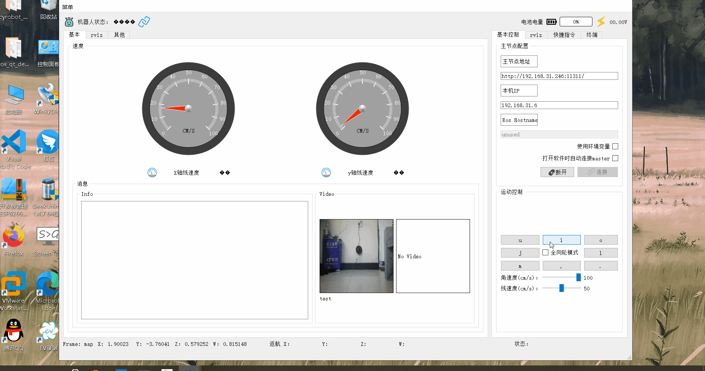

# ROSBOT

本仓库建立目的是为了给同学们在ROS机器人开发中提供帮助。

国外仓库链接Github：https://github.com/Githubcxy666/ROSBOT

国内仓库链接Gitee：https://gitee.com/wybros/ROSBOT

仓库部分资料来源互联网，如有侵权，请联系邮箱 344214187@qq.com，必定在72小时内处理。

如果同学们有新资源提供分享，也请联系邮箱 344214187@qq.com。

关注微信公众号【ROS机器人开发】，获取更多ROS机器人开发资料，还有抽奖活动！

.jpg)

## 目录

### [ROS安装](#1)

### [ROS开发环境搭建](#ROS开发环境搭建)

### [ROS相关软件安装](#ROS相关软件安装)

### [ROS问题总汇](#ROS问题总汇)

### [ROS教程](#ROS教程])

### [ROS进程功能教程](#ROS进程功能教程)

### ROS代码demo

### [ROS人机界面开发教程](#ROS人机界面开发教程)

### [ROS安卓APP](#ROS安卓APP)

### [ROS书籍推荐](#ROS书籍推荐)

### [Git使用教程](#Git使用教程)

### [机器人运动学模型](#机器人运动学模型)

### [路径规划算法](#路径规划算法)

### [SLAM](#SLAM)

### [机器视觉](#机器视觉)

### [语音识别和控制](#语音识别和控制)

### [机器狗项目spotMicro](#机器狗项目spotMicro)

### [硬件资料](#硬件资料)

### [编程资料](#编程资料)

### [贡献者](#贡献者)

&nbsp;

&nbsp;

跳转到的地方

## ROS安装

### 虚拟机ROS安装

- #### 虚拟机镜像安装教程（阿里云）

  - [ubuntu-16.04.7-desktop-amd64 镜像下载链接](http://mirrors.aliyun.com/ubuntu-releases/16.04/ubuntu-16.04.7-desktop-amd64.iso)

  - [ubuntu-18.04.5-desktop-amd64 镜像下载链接](http://mirrors.aliyun.com/ubuntu-releases/18.04/ubuntu-18.04.5-desktop-amd64.iso)

  - [ubuntu-20.04.2.0-desktop-amd64 镜像下载链接](http://mirrors.aliyun.com/ubuntu-releases/20.04/ubuntu-20.04.2.0-desktop-amd64.iso)

- 
  #### 	    Kinect版本安装教程（ros init失败解决办法请看melodic版本安装）

- #### 	    melodic版本安装教程（附带ros init失败解决办法）

- #### 	[notice版本安装教程（附带ros init失败解决办法）](http://www.autolabor.com.cn/book/ROSTutorials/chapter1/12-roskai-fa-gong-ju-an-zhuang/124-an-zhuang-ros.html)

### 树莓派ROS安装

- #### 树莓派安装教程

- 
  #### 	Kinect版本安装教程

- #### 	melodic版本安装教程

- #### 	notice版本安装

### Jetson nano ROS安装

- #### Jetson nano 安装教程

- 
  #### 	Kinect版本安装教程

- #### 	melodic版本安装教程

- #### 	notice版本安装

&nbsp;

## ROS开发环境搭建

### [Vscode安装和配置（C++和Python）](http://www.autolabor.com.cn/book/ROSTutorials/chapter1/14-ros-ji-cheng-kai-fa-huan-jing-da-jian/142-an-zhuang-vscode.html)

&nbsp;

### Clion安装和配置

- #### [安装教程](https://blog.csdn.net/ChuiGeDaQiQiu/article/details/114324796)

- #### [配置教程](https://www.jb51.net/article/193563.htm)

&nbsp;

## ROS相关软件安装

### [cartography安装教程](https://github.com/WLwind/cartographer_installation)

&nbsp;

### ROS serial 串口通信功能包安装

  - 
    #### 	Kinect版本安装教程

    `sudo apt-get install ros-kinetic-serial`

  - #### 	melodic版本安装教程

    `sudo apt-get install ros-melodic-serial`

  - #### 	notice版本安装

    `sudo apt-get install ros-notice-serial`

&nbsp;

### 串口调试软件安装

建议使用cutecom

  - #### [cutecom 安装和使用教程](https://blog.csdn.net/shui1025701856/article/details/79277484/)

  - #### [minicom 安装和使用教程](https://blog.csdn.net/mybelief321/article/details/8987502)

&nbsp;

### opencv安装

`pip install opencv-python`

&nbsp;

### [teleop_twist_keyboard 键盘控制功能包安装](https://github.com/ros-teleop/teleop_twist_keyboard)

&nbsp;

### ROS gazebo仿真模型

  gazebo模型官方下载链接：https://github.com/osrf/gazebo_models

  为了方便大家下载，已上传到百度云盘

  关注微信公众号：ROS机器人开发

  回复  999 即可获取下载链接

&nbsp;

### navigation功能包安装

- 
  #### 	Kinect版本安装教程

  `git clone -b kinetic-devel https://github.com/ros-planning/navigation.git`

- #### 	melodic版本安装教程

  `git clone -b melodic-devel https://github.com/ros-planning/navigation.git`

- #### 	notice版本安装

  `git clone -b noetic-devel https://github.com/ros-planning/navigation.git`

&nbsp;

### robot_pose_ekf 安装教程

`git clone https://github.com/ros-planning/robot_pose_ekf.git`

&nbsp;

### 雷达驱动包安装

- 
  #### 	RPLIDAR(思岚)

  官方Github链接：https://github.com/Slamtec/rplidar_ros

  `git clone https://github.com/Slamtec/rplidar_ros.git`

  RPLidar A1示意图
  
  
  
  
  
  RPLidar A2示意图
  
  

&nbsp;

## [ROS问题总汇](problems.md)

&nbsp;

## ROS教程

**以下排名不分先后**

### 	ROS WIKI 

网站链接： http://wiki.ros.org/cn/ROS/Tutorials

&nbsp;

### 	古月居

- 
  #### 		ROS入门21讲

  视频教程：https://www.bilibili.com/video/BV1zt411G7Vn

- #### ROS机器人开发案例

  视频教程：https://www.bilibili.com/video/BV1vb41177qN

- #### 		ROS机械臂开发原理

  视频教程：https://www.bilibili.com/video/BV14b411p7Hm

&nbsp;

### 	中国大学MOOC --《机器人操作系统入门》

&emsp;&emsp;视频教程：https://www.bilibili.com/video/BV1PJ411D7mj?from=search&seid=367619698396859163

&emsp;&emsp;课程讲义---Gitbook：https://sychaichangkun.gitbooks.io/ros-tutorial-icourse163/content/ 

&emsp;&emsp;代码示例---Github：https://github.com/DroidAITech/ROS-Academy-for-Beginners （注意版本）

&nbsp;

### 奥特学园 -- ROS机器人入门课程《ROS理论与实践》零基础教程

&emsp;&emsp;作者：赵虚左老师

&emsp;&emsp;视频教程： https://www.bilibili.com/video/BV1Ci4y1L7ZZ?p=1

&emsp;&emsp;课程文档： http://www.autolabor.com.cn/book/ROSTutorials/

&nbsp;

### ROS小课堂 -- ROS快速入门课程

&emsp;&emsp;视频教程：https://space.bilibili.com/407185400/channel/detail?cid=147661

&nbsp;

### ROS入门教程 - 创客智造

&emsp;&emsp;网站链接：https://www.ncnynl.com/archives/201608/496.html

&nbsp;

### 深蓝学院 

- #### ROS机器人开发案例——浅谈如何将ROS应用于机器人开发

  &emsp;&emsp;视频教程：https://www.bilibili.com/video/BV1Yb411h7jg

&nbsp;

### 黑马程序员_零基础玩转机器人操作系统ROS

&emsp;&emsp;视频教程：https://www.bilibili.com/video/BV1Bh411y7QM

&nbsp;

### 小白学移动机器人

&emsp;&emsp;课程文档：https://blog.csdn.net/zhao_ke_xue/article/details/108138981

&nbsp;

### 小虎哥哥爱学习

&emsp;&emsp;课程文档：https://www.cnblogs.com/hiram-zhang/p/10802569.html

&nbsp;

## ROS进阶功能教程

### 多点导航

&nbsp;

### ROS开机启动

- #### [robot_upstart方法](https://zhuanlan.zhihu.com/p/163048849)

- #### [ubuntu自带upstart方法](https://blog.csdn.net/r1141207831/article/details/102941613)

&nbsp;

### [虚拟墙](https://blog.csdn.net/weixin_42005898/article/details/101757709)

### 语音交互

### 使用自定义的全局路径规划算法

- #### [ROS WIKI教程](http://wiki.ros.org/navigation/Tutorials/Writing%20A%20Global%20Path%20Planner%20As%20Plugin%20in%20ROS)

- #### [创客智造教程](https://www.ncnynl.com/archives/201708/1887.html)

&nbsp;

### 多车仿真

### 搭建ROS仿真小车模型

### [相机模拟激光数据并避障](https://blog.csdn.net/qq_39266065/article/details/108714973)

### 目标检测

- #### [实时目标检测(darknet_ros)](https://www.rt-thread.org/document/site/tutorial/smart-car/object-detection/object-detection/)

- #### [Ros平台下基于face_recognition的人脸检测及识别](https://blog.csdn.net/qq_41658212/article/details/105399909)

- #### [摄像头标定和opencv识别](https://zhuanlan.zhihu.com/p/179166753)

## ROS代码demo

### Topic通信

- #### C++版本

- #### Python版本

### 自义定msg

- #### C++版本

- #### Python版本

### Server通信

- #### C++版本

- #### Python版本

### 参数服务器

- #### C++版本

- #### Python版本

## ROS常用命令

#### [教程示例](http://www.autolabor.com.cn/book/ROSTutorials/di-2-zhang-ros-jia-gou-she-ji/24-chang-yong-ming-ling.html)

&nbsp;

## ROS文件详解

### [launch文件](http://www.autolabor.com.cn/book/ROSTutorials/5/45-rosjie-dianguan-li-launch-wen-jian.html)

### [CMakeLists.txt文件](https://blog.csdn.net/weixin_42587961/article/details/86381730)

### [package.xml文件](https://blog.csdn.net/qq_43667745/article/details/90137505)

&nbsp;

## ROS 人机界面开发教程

### [基于Qt5的ROS人机交互界面(蒋程扬老师)](https://github.com/chengyangkj/Ros_Qt5_Gui_App)

&nbsp;

## ROS安卓APP

&nbsp;

## [ROS书籍推荐](books.md)

&nbsp;

## Git使用教程

### [高质量的Git中文教程](https://github.com/geeeeeeeeek/git-recipes)

### [Git小白教程](https://rogerdudler.github.io/git-guide/index.zh.html)

### [Git的奇技淫巧](https://github.com/521xueweihan/git-tips)

&nbsp;

## 机器人运动学模型

### [两轮差速结构](https://blog.csdn.net/iProphet/article/details/83661753)

### [麦克纳姆结构](https://blog.csdn.net/weixin_30627381/article/details/97069120)

### [阿克曼转向结构](https://blog.csdn.net/u013914471/article/details/82968608)

&nbsp;

## 路径规划算法

### 基于图搜索的路径规划算法

- #### Dijkstra算法（D）

  - ##### 文字

  - ##### 视频

    - [《Dijkstra算法讲解》（IR艾若机器人）](https://www.bilibili.com/video/BV1yT4y1T7Eb?p=2)
    - [《路径规划与轨迹跟踪系列算法学习第1讲Dijkstra算法》by 小黎的Ally](https://www.bilibili.com/video/BV19T4y1M7uR)

&nbsp;

- #### A星算法（A* /Astar）

  - ##### 文字

  - ##### 视频

    - [《A*算法讲解》by IR艾若机器人](https://www.bilibili.com/video/BV1yT4y1T7Eb?p=4)
    - [《路径规划与轨迹跟踪系列算法学习第4讲A*算法》by 小黎的Ally](https://www.bilibili.com/video/BV1Jt4y1z7Ry)

### 基于采样的路径规划算法

- #### RRT算法

  - ##### 文字

  - ##### 视频

    - [《RRT算法讲解》（IR艾若机器人）](https://www.bilibili.com/video/BV1yT4y1T7Eb?p=5)

- #### RRT*算法
  - ##### 文字

  - ##### 视频

    - [《RRT*算法讲解》（IR艾若机器人）](https://www.bilibili.com/video/BV1yT4y1T7Eb?p=6)

- #### Informed RRT*算法
  - ##### 文字

  - ##### 视频

    - [《Informed RRT* 算法讲解》（IR艾若机器人）](https://www.bilibili.com/video/BV1yT4y1T7Eb?p=7)

&nbsp;

## SLAM

### 激光slam

- #### 教程

- #### 视频

  - [《slam 激光传感器与无人驾驶（完）》](https://www.bilibili.com/video/BV1hb411L7VF?from=search&seid=428409986740182790)

### 视觉slam

- #### 文章

  - ##### [《视觉SLAM十四讲》笔记摘抄](https://blog.csdn.net/ncepu_Chen/article/details/105322585)

- #### 视频

  - [《视觉十四讲（第二版）》（高翔老师）](https://www.bilibili.com/video/BV1Dz4y1S7gn?p=1)
  - [《浙江大学视觉slam公开课-从视频标定到SLAM》](https://www.bilibili.com/video/BV1ax411R7Hd?p=1)

&nbsp;

## 机器视觉

&nbsp;

## 语音识别和控制

### ROS与语音交互教程 - 创客智造

&emsp;&emsp;教程链接： https://www.ncnynl.com/category/ros-voice/

### 古月居 ROS探索总结（十）—— 语音控制

&emsp;&emsp;教程链接： https://www.guyuehome.com/260

### 天之博特  中文ROS语音交互模块

&emsp;&emsp;教程链接： http://doc.tianbot.com/rosecho/1586400

### ROS小课堂 

&emsp;&emsp;视频链接： https://www.youku.com/profile/index/?spm=a2hbt.13141534.1_1.1&uid=UMTUzNzkwNTA1Ng==  （搜索语音交互）

### 小虎哥哥爱学习

&emsp;&emsp;课程链接： https://www.cnblogs.com/hiram-zhang/p/10421162.html

&nbsp;

## [机器狗项目spotMicro](https://github.com/mike4192/spotMicro)

&nbsp;

## 硬件资料

### 底层控制板

- #### STM32

- #### arduino

### 上层控制板

- #### 树莓派

- #### jetson nano

&nbsp;

## 编程资料

### C/C++

- #### 电子书

  - 《21天学通c++_第7版》        
  - 《C++ Primer Plus（第6版）中文版》

- #### 视频教程

  - [黑马程序员C++从0到1入门编程（附C++编程环境搭建教程）](https://www.bilibili.com/video/BV1gb411Y7Yh)

### Python

- #### 电子书

  - 《Python编程  从入门到实践》
  - 《Python3.5从零开始学》

- #### 视频教程

  - [黑马程序员Python小白基础入门教程 Python入门到精通教程](https://www.bilibili.com/video/BV1Az4y1S7oK?p=1)

### Linux

- #### 电子书

  - 《鸟哥的Linux私房菜-基础篇-第四版》

- #### 视频教程

  - [黑马程序员linux入门到精通 （上）](https://www.bilibili.com/video/BV1nW411L7xm)
  - [黑马程序员linux入门到精通 （下）](https://www.bilibili.com/video/BV1DW411G7VB)

&nbsp;

## 扩展视频

&nbsp;

## 贡献者

这个项目的存在要感谢所有贡献者。 请给我们一个 🌟 Star 🌟支持我们。 谢谢。 并感谢所有支持者！ 🙏